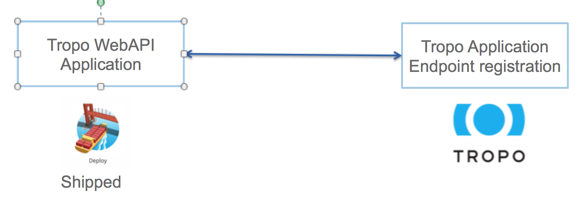

# Tropo WebAPI Shipped Buildpack

This is hello  sample application to demonstrate how to build, deploy, run and iterate Tropo web API based application Shipped.

Following section provide more details and links to Tropo and how to register application endpoint once deployed it is deployed on Shipped.

## Zero to functioning Tropo app, build and deploy on Shipped

[Tropo App E2E Video](https://cisco.webex.com/ciscosales/lsr.php?RCID=71d84c45796443f48c9e64d3e6c5f743)

### Creating and deploying tropo App on Shipped
For creating Application in Shipped using Tropo buildpack refer to getting started section of Shipped document:  http://shipped-cisco.com/shipped/api-docs/build/index.html#walkthroughs

At service creation Step need to select "Cisco Tropo WebAPI" Buildpack under API tab. Rest
project creation and and deployment section will remain same.

## Sample Application
This sample application implements following sample voice flow:
- User call to Weather office
- User given 2 options to select 1. Get weather for zipcode 2. Contact employees
   - User select 1. whether option
     - Enter 5 digit zip code
     - Weather details for city using voice response
   - User select 2. to contact employees
     - Provide list of employees
     - User tell employee name by voice command
     - System forwards call to employee if name exist in directory.

## About Tropo
Tropo makes it simple to automate communications, connecting your code to the phone network with both voice and messaging. You use the web technologies you already know and Tropo’s powerful cloud API to bring real-time communications to your apps.

[More ...](https://www.tropo.com/how-it-works)

you may have a look at the [Tropo Documentation](https://www.tropo.com/docs/) before beginning to this tutorial.

### Step 1
To create a tropo application you need to have a tropo account, so visit [www.tropo.com](https://www.tropo.com) and register yourself.

### Step 2
 Login with you valid credentials.

### Step 3
 Once you login you can go to the My Application tab. CLick on "Create New App" button to launch create app wizard.

### Step 4
Provide the application name.

## Step 5
Choose the type of application, you will find two option here
- Scripting Api: To deploy and run your application at tropo servers.
- Web(HTTP) Api: For running your tropo application running on your servers.

in this case we will select "Web (HTTP) Api" as we will host our application on cisco shipped servers.

Now find the shipped url where your application is hosted already. copy this urls

Note: For building and deploying app in Shipped refer  http://shipped-cisco.com/shipped/api-docs/build/index.html#walkthroughs . Choose 'Cisco Tropo WebAPI' buildpack under API tab while creating new service.  

### Step 5
Specify your application url. and click on "Create App" button.

### Step 6
Next Screen will show you application details and script details.
make sure right scripting uls are reflected for Voice and Text scripts, if not you can update them and "Save Settings"

### Step 7
Scroll down to the same screen you may find VOIP Details. from here you can test your application settings.
click on button "Call App from browser"

### Step 8
Now click on Call button, you should hear a call running your application script hosted on shipped server.

